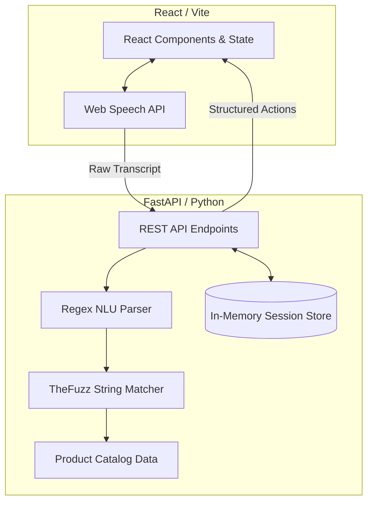

# Voice-Based Online Shopper

A lightning-fast, privacy-first web application that allows users to manage their shopping lists using conversational voice commands. 

Designed for speed and reliability, this application completely bypasses slow cloud LLMs. It uses a custom **Local Python NLU Engine** with advanced regex parsing and fuzzy string matching to instantly understand complex voice commands like *"Add half a dozen eggs and 1.5 kg of potatoes"*.

---

## Features

- **Instant Voice Recognition**: Leverages the browser's native Web Speech API for real-time transcription.
- **Local NLU Engine**: Zero-latency processing. No cloud LLMs, no external dependencies, and 100% privacy. 
- **Advanced Quantity Parsing**: Intelligently parses fractions, decimals, and natural aliases (e.g., `"half a dozen" -> 6`, `"0.5 kg" -> 0.5`).
- **Multi-Item Commands**: Supports compound instructions separated by "and" (e.g., *"Add apples and remove bananas"*).
- **Smart Conversational Follow-Ups**: Evaluates cart additions in real-time against a predefined relational catalog to dynamically prompt the user with highly relevant follow-up items.
- **Fuzzy Catalog Matching**: Employs Levenshtein distance (`thefuzz`) to seamlessly auto-correct misheard or misspelled item names.
- **Dimensional Math Engine**: Intelligently converts, normalizes, and sums overlapping items across different unit dimensions (e.g., adding `500 g` to `1 kg` seamlessly merges to `1.5 kg`).
- **Smart Suggestions**: Automatically computes frequently and recently bought items to populate a smart suggestion UI track.
- **Concurrency-Safe**: Backend state is fully thread-safe, utilizing per-session `asyncio.Lock` structures to prevent race conditions during parallel updates.
- **Strict Catalog Validation**: Integrates a predefined product catalog to strictly validate units (e.g., preventing users from adding a "liter of potatoes").
- **Modern UI**: A premium, responsive React interface featuring glassmorphic micro-animations, toast notifications, and interactive suggestion chips.

### 🎮 Manual Testing Guide
Once the app is running, try the following voice commands (or manual inputs) to test the advanced features:
- **Test Quantity Parsing**: Say *"Add half a dozen eggs"* (It will accurately add 6 eggs).
- **Test Dimensional Math**: Say *"Add 1 kg of potatoes"*, then say *"Add 500 grams of potatoes"*. (It will automatically merge them into 1.5 kg).
- **Test Fuzzy Matching**: Say *"Add tomaato"* (It will auto-correct to tomato).
- **Test Conversational Follow-Ups**: Say *"Add milk"* (A banner will slide down prompting you to add cookies, cereal, or coffee).
- **Test Smart Suggestions**: Click any of the suggested chips under the "Things to get" header to instantly add them to your cart. 

---

## Architecture

The application follows a decoupled client-server architecture. For a deep-dive into the Natural Language Understanding pipeline, fuzzy matching, dimensional math logic, and the exact journey of a spoken command, please read the **[Logic & Architecture Documentation](logic/logic_documentation.md)**.



### 1. The Frontend (React + TypeScript)
The UI acts as the presentation and recording layer. It initiates the Web Speech API and captures the user's raw transcript. Upon receiving a transcript, it sends a payload to the backend `/api/nlu` endpoint and immediately executes the returned structured intents against the `/api/items` state endpoints.

### 2. The Backend NLU Pipeline (FastAPI)
When the backend receives a raw string, it processes it through a strict, deterministic pipeline:
1. **Splitting**: The string is split into distinct fragments by conjunctions (e.g., "and").
2. **Intent Parsing**: Highly tuned regular expressions extract the action (`ADD`, `REMOVE`, `SEARCH`), the quantity (integers, floats, or aliases), the unit (kg, grams, pieces), and the raw item name.
3. **Fuzzy Matching**: The raw item name is cross-referenced against the `catalog.py` using `thefuzz` library to handle misspellings and plurals (e.g., `"tomaato" -> "tomato"`).
4. **Validation**: The `restricter.py` logic verifies that the requested unit makes physical sense for the matched catalog item.

### 3. Session State Management
The backend stores shopping lists in an in-memory dictionary. To handle rapid, concurrent API requests from the frontend (such as processing multiple intents simultaneously), the backend uses an `X-Session-ID` header to provision a lazy-loaded `asyncio.Lock` for every unique session, guaranteeing data consistency.

---

## Project Setup

Follow these steps to run the complete stack locally on your machine.

### Prerequisites
- Node.js (v18+)
- Python (3.9+)

### 1. Clone the Repository
```bash
git clone https://github.com/SuyashSoni10/voice-command-shopper.git
cd voice-command-shopper
```

### 2. Start the Python Backend
Open a terminal and start the FastAPI server:
```bash
cd backend
python -m venv venv
source venv/bin/activate  # Or `venv\Scripts\activate` on Windows
pip install -r requirements.txt
uvicorn main:app --reload --port 8000
```
The backend API will now be running on `http://localhost:8000`.

### 3. Start the React Frontend
Open a new terminal and start the Vite development server:
```bash
cd frontend
npm install
npm run dev
```
The UI will be accessible at `http://localhost:5173`. 

---

## Testing

### Automated Test Suite
The backend includes a comprehensive, edge-case hardened test suite to verify the NLU logic and concurrency safety.
```bash
cd backend
python test_suite.py
```
